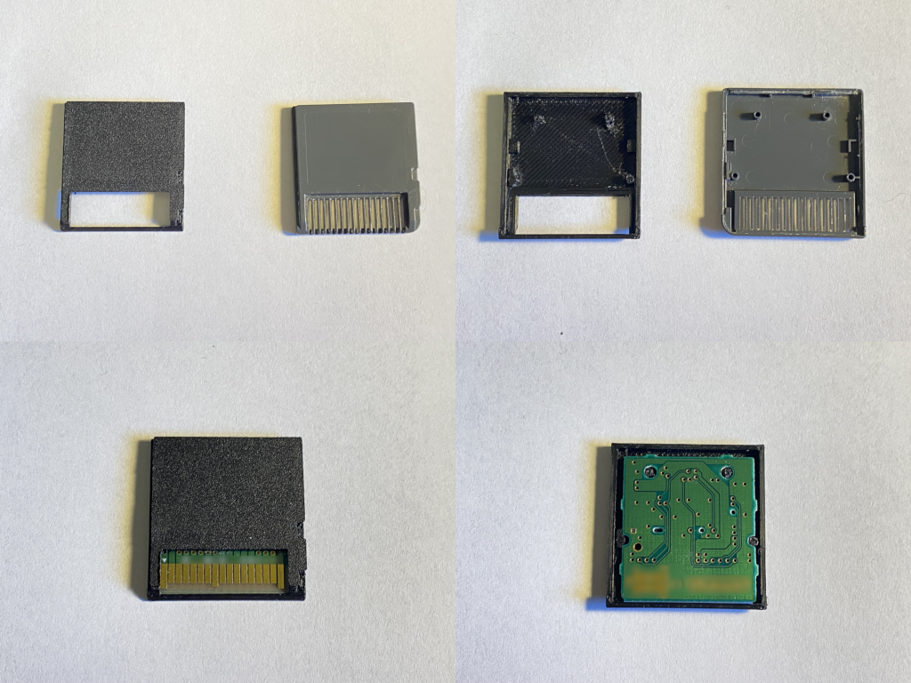

# openntrcard
WIP reverse-engineering project for the Nintendo DS Game Card

## What is this?
As it currently stands, an OpenSCAD file describing the Nintendo DS "Game Card" housing - both front (label) and back (PCB) halves.

The main SCAD file - `gamecard.scad` - is a direct replica of the OEM Game Card housing.
**It does NOT include a way to join the two halves**. On retail games, the two halves are welded/glued/etc at the factory.
For my prototypes, I am using standard Scotch/cellophane tape to hold the two halves together.

On my R4 card (original `(NDS/NDSL)` R4) there is a single screw through the center of the card to hold it together.
If this model is to be adapted for flash-card use, a similar modification is recommended

## Why?
All modern flash-cards for the Nintendo DS are (if memory serves me correctly) based on the Acekard 2i design. 
This is a closed-source design, running proprietary software, made by anoymous sources in and around China.
Due to recent world events, supply of these cards is very limited.
Without these cards, it is impossible to run homebrew software on original Nintendo DS consoles.

In addition, many of the cards that are out there have "time bombs".
This means that the cards will cease working after the system clock reaches a certain date,
to encourage the user to buy another card.
Whilst this is easily bypassed, it is a nuisance, especially in regards to games that use the clock for time-based events.

My eventual end-goal is to provide - at the very least - the building-blocks for an open-source Nintendo DS flash-card.
This will allow people to create open alternatives to the R4 card for running homebrew software on the Nintendo DS.

In addition, a "stretch goal" for myself is to build my own Nintendo DS flashcard.
I only have limited software development knowledge, and next to no hardware design knowledge.
However, I will still hold this as an eventual pipe-dream goal for this repository.
